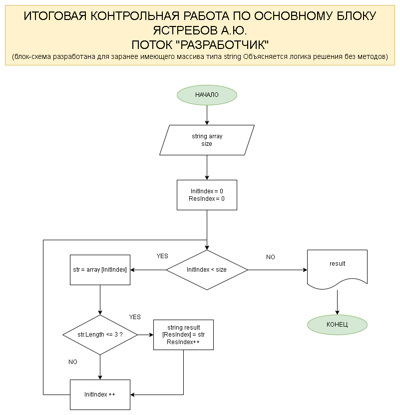

# Constrol_Work_Before_Specialization
Perform a task for Control Quiz in 2024. Sent after the Introductory part of education at GeekBrains. Hopefully checked before continuing the Specialized Part of Education

The Task is executed by Yastrebov Alex, Astana, Kazakhstan.

All the details on the task you can get from Task_Description. md file.

Here we will state the stages of preparation and execution of the task described inside the abovementioned file.

## The Main Task 

Write down the code which will form up a new array out of the existing array of string type, the length of which is less or equal to 3 symbols. The initial array might be read from keyboard or sset at the beginning of executing the algorithm. During solution it is not recommended to use collections, better use the arrays only.

## Stages to be done at the project

* Create remote repo at GitHub.com
    
    * Status : Done on 05/03/24
    >Comment: Follow the link to see the repo
    >
    >https://github.com/Al-LastSur/Constrol_Work_Before_Specialization.git

* Draw a block-chain on the project

    * Status : Done on 08/03/24
    >Comment:Blockchain contains main principles to do the task

* Write down the code for solving the Task
    
    * Status : Done on 08/03/24 

* Write README.md file to the project describing all the stages of the task

    * Status : Done on 08/03/24
    >Comment: File is filled in with picture and information on status throughout the whole process

* Use version control to track the progress of the task

    * Status : Done throughout the project.

# Possible Task Solution in brief explanation

## What do we have at the beginning?

Introduced array of string type. Alternatevely the array might be read from console.

## The Solution process

1. Calculate the amount of symbols of each element of initial array
>Comment : CalculateStringLength method applied successfully. The program identifies the amount of symbols in each element of string array
2. identify if the element has less or equal to 3 elements in itself
> Comment: alculateSizeFinalArray method identifies the amount of elemens in an array corresponding to the condition of 3 or less symbols in it and returns the amount of such elements in the array
3. Check the existing array for the conditions into add to the new array
>Comment: steps 3 and 4 included at the same method, but the length of new array is determined separately.
4. Create a new empty array
>Comment: the recursion was used to fill in the result array with elements.
5. Copy the content of the initial element to new array element
>Comment: 
6. Print resulting array to console 
>Comment: the program is giving several types to check the result
* Uncomment one of the given lines at a time;
* Uncomment the block with option where you input the elemntsfrom console (input the amount of elements first, and each element then).
>(Warning! The coding system 1251 couldn't support Russial letters when they are read from the console)

## What do we have at the End?

The array formed of the elements of initial array corresponding to the Task requirements.