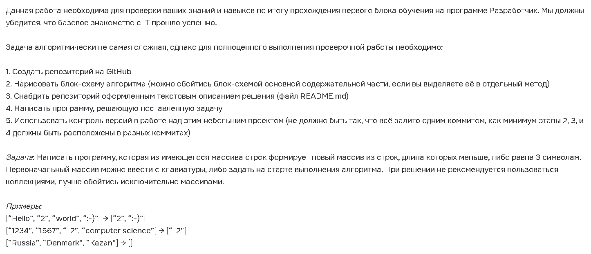

# Final Quiz after Introductory Course to IT
>The information down below is given in Russian and translated into English as the part of Task for Showing the skills obtained during the Course.

Copied from task page at GB:

>The abovementioned was translated into English:

The Task is necessary for checking your knowledge and skills on the results oа passing through the first step in education on the programme Developper. We have to check that your basic knowledge of IT has been successful.
The Task is algorithmically is not so diffiluct, however for total слусл-up of the executed work it is necessary:
1. To create a repo at GitHub
2. to draw block-chain of the algorithm (it's allowed to describe block-chain of the basic content part, if you place it as a eparate method)
3. To attach the repo with formulated text description of the Task (README.md file)
4. To write the code solving the task being set.
5. Use version control during your work on the project (all the job shouldn't be executed in one commit, as minimum the stages 2,3,and 4 must be allocated inside the different commits)

The task: Write down the code which will form up a new array out of the existing array of string type, the length of which is less or equal to 3 symbols. The initial array might be read from keyboard or sset at the beginning of executing the algorithm. During solution it is not recommended to use collections, better use the arrays only.